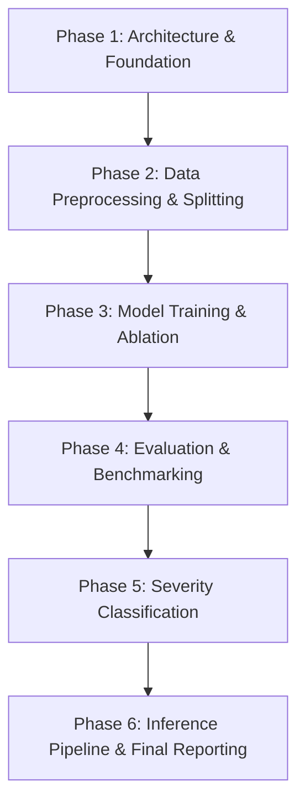

# AI-Based Pothole Recognition Using Unmanned Aerial Vehicles (UAVs)
## Comprehensive Step-by-Step Project Roadmap & Status Tracker

**Project:** Automated Road Inspection Using UAV Aerial Imagery, Computer Vision (YOLOv11 / YOLOv8), and CLAHE Preprocessing  
**Target:** Academic Research Project / B.Tech Artificial Intelligence  
**Contributors:** Ajay Kumaar (24BRS1287) & Hariaswath (24BRS1290)  
**Last Updated:** September 2026  

---

### Status Legend
- `[x] COMPLETED`: Fully implemented, tested, and present in the codebase.
- `[-] IN PROGRESS / SKELETON`: Scaffolded or template created, but requires completion.
- `[ ] PENDING / TO DO`: Needs to be implemented in chronological order.

---

## Chronological Implementation Roadmap

---

### Phase 1: Repository Architecture & Data Foundation (DA1 Milestone)
*Goal: Establish a rigorous research codebase, automated data auditing, and contrast enhancement utilities.*

- [x] **1.1 Research Workspace Structure**
  - Standardized directory tree (`data/`, `preprocessing/`, `scripts/`, `docs/`, `notebooks/`).
  - Formatted [`.gitignore`](file:///c:/Users/Lenovo/OneDrive/Desktop/AI_PRO/uav-pothole-recognition/.gitignore) to exclude large datasets, preprocessed cache, and model weights.
  - Defined initial [`requirements.txt`](file:///c:/Users/Lenovo/OneDrive/Desktop/AI_PRO/uav-pothole-recognition/requirements.txt) with core computer vision libraries.
- [x] **1.2 Automated Dataset Discovery Engine**
  - Implemented [`data/dataset_loader.py`](file:///c:/Users/Lenovo/OneDrive/Desktop/AI_PRO/uav-pothole-recognition/data/dataset_loader.py) with dynamic directory scanning and path resolution.
  - Auto-generation of YOLO configuration file ([`dataset.yaml`](file:///c:/Users/Lenovo/OneDrive/Desktop/AI_PRO/uav-pothole-recognition/dataset.yaml)).
- [x] **1.3 Data Integrity & Quality Audit Engine**
  - Implemented [`data/check_dataset.py`](file:///c:/Users/Lenovo/OneDrive/Desktop/AI_PRO/uav-pothole-recognition/data/check_dataset.py) checking for orphaned labels, missing annotations, corrupt image headers, and empty files.
  - Identified dataset anomalies: 11 unlabeled images and 381 orphan annotation text files.
- [x] **1.4 Dataset Statistical Profiling**
  - Implemented [`data/dataset_statistics.py`](file:///c:/Users/Lenovo/OneDrive/Desktop/AI_PRO/uav-pothole-recognition/data/dataset_statistics.py) generating resolution, file size, and class distributions.
  - Identified severe class imbalance: `agujero` (Potholes): 91.40% vs `grietas` (Cracks): 8.60%.
- [x] **1.5 CIE LAB Contrast Enhancement (CLAHE)**
  - Implemented [`preprocessing/clahe.py`](file:///c:/Users/Lenovo/OneDrive/Desktop/AI_PRO/uav-pothole-recognition/preprocessing/clahe.py) with BGR $\to$ LAB color space conversion, isolating L* luminance channel equalization (clip limit: 2.0, grid: 8x8) to handle UAV shadow variations without chromatic distortion.
- [x] **1.6 Resolution Normalization Utility**
  - Implemented [`preprocessing/resize.py`](file:///c:/Users/Lenovo/OneDrive/Desktop/AI_PRO/uav-pothole-recognition/preprocessing/resize.py) downscaling 4K UAV images to 640x640 with bilinear interpolation while retaining normalized bounding coordinates.
- [x] **1.7 Master Execution & Platform Installers**
  - Implemented [`scripts/run_checks.py`](file:///c:/Users/Lenovo/OneDrive/Desktop/AI_PRO/uav-pothole-recognition/scripts/run_checks.py) to run all data audits sequentially.
  - Created [`scripts/install.bat`](file:///c:/Users/Lenovo/OneDrive/Desktop/AI_PRO/uav-pothole-recognition/scripts/install.bat) (Windows) and [`scripts/install.sh`](file:///c:/Users/Lenovo/OneDrive/Desktop/AI_PRO/uav-pothole-recognition/scripts/install.sh) (Linux) environment setups.
- [x] **1.8 Python 3.11 Environment Setup**
  - Isolated virtual environment (`.venv`) created with CPython 3.11.
  - Core dependencies installed and verified (`opencv-python`, `pillow`, `matplotlib`, `numpy`, `pyyaml`, `tqdm`).
- [x] **1.9 Visual Inspection & Bounding Box Overlay Notebook**
  - Implemented [`notebooks/dataset_visualization.ipynb`](file:///c:/Users/Lenovo/OneDrive/Desktop/AI_PRO/uav-pothole-recognition/notebooks/dataset_visualization.ipynb).
  - Loads sample images, denormalizes YOLO bounding box coordinates to pixel coordinates, draws color-coded bounding boxes (`agujero` = Crimson Red, `grietas` = Bright Cyan), and renders side-by-side Raw vs. CIE LAB CLAHE comparisons.
- [x] **1.10 Technical Documentation Writeups (`docs/`)**
  - Completed [`docs/Pipeline.md`](file:///c:/Users/Lenovo/OneDrive/Desktop/AI_PRO/uav-pothole-recognition/docs/Pipeline.md): Mathematical formulations for CLAHE in CIE LAB color space, L* luminance channel isolation, clip limit (2.0), and proof of YOLO bounding box coordinate invariance under 640x640 resizing.
  - Completed [`docs/Architecture.md`](file:///c:/Users/Lenovo/OneDrive/Desktop/AI_PRO/uav-pothole-recognition/docs/Architecture.md): Detailed comparison of YOLOv11 (C3k2 blocks, SPPF, decoupled anchor-free head) vs YOLOv8 baseline, along with mathematical severity grading formulas (Minor, Moderate, Severe) and Maintenance Priority Score (MPS).
  - Completed [`docs/Dataset.md`](file:///c:/Users/Lenovo/OneDrive/Desktop/AI_PRO/uav-pothole-recognition/docs/Dataset.md): Format explanation, empirical audit metrics (111 matched pairs, 381 orphan labels, 11 unannotated images), and 3 specific class imbalance mitigation strategies (Focal Loss, class weighting, minority augmentations).

---

- [x] **1.11 Real-World Dataset Ingestion**
  - Integrated real-world road defect dataset into [`dataset/`](file:///c:/Users/Lenovo/OneDrive/Desktop/AI_PRO/uav-pothole-recognition/dataset) (736 total images: 640 train, 64 valid, 32 test).
  - Automated conversion of COCO annotations into standard YOLO bounding box labels (`data/coco_to_yolo.py`).
  - Configured `classes.txt` and verified 100% paired image-label integrity with 0 missing labels, 0 corruptions, and 0 duplicate stems.

---

### Phase 2: Batch Preprocessing & Dataset Partitioning
*Goal: Prepare a clean, standardized, enhanced dataset partitioned for training and validation.*

- [x] **2.1 Dataset Pair Sanitization & Quality Verification**
  - Ran [`scripts/run_checks.py`](file:///c:/Users/Lenovo/OneDrive/Desktop/AI_PRO/uav-pothole-recognition/scripts/run_checks.py): all checks passed cleanly (`dataset_loader.py`: PASSED, `dataset_statistics.py`: PASSED, `check_dataset.py`: PASSED).
  - Verified class distribution: 543 `agujero` (pothole) bounding boxes (61.92%) and 334 `grietas` (crack) bounding boxes (38.08%).
- [x] **2.2 Batch CLAHE Enhancement Execution**
  - Executed [`preprocessing/clahe.py`](file:///c:/Users/Lenovo/OneDrive/Desktop/AI_PRO/uav-pothole-recognition/preprocessing/clahe.py) across all 736 images with CIE LAB $L^*$ channel equalization (clip limit: 2.0, grid: 8x8).
  - Output stored in `preprocessing/output/` with mirrored labels and directory hierarchy.
- [x] **2.3 Batch 640x640 Resizing Execution**
  - Executed [`preprocessing/resize.py`](file:///c:/Users/Lenovo/OneDrive/Desktop/AI_PRO/uav-pothole-recognition/preprocessing/resize.py) on all 736 CLAHE-enhanced images.
  - Successfully produced 640x640 training-ready dataset in `preprocessing/output_resized/`.
- [x] **2.4 Train / Validation / Test Splitting Configuration**
  - Standardized split structure: 640 train images, 64 validation images, 32 test images.
  - Updated [`dataset.yaml`](file:///c:/Users/Lenovo/OneDrive/Desktop/AI_PRO/uav-pothole-recognition/dataset.yaml) pointing to relative split paths (`train: train`, `val: valid`, `test: test`).

---

### Phase 3: Model Architecture & Deep Learning Training (DA2 Milestone)
*Goal: Train state-of-the-art YOLOv11 and baseline YOLOv8 models on raw and preprocessed UAV images.*

- [x] **3.1 Deep Learning Dependencies Integration**
  - Added `ultralytics>=8.3.0`, `torch>=2.0.0`, and `torchvision` to [`requirements.txt`](file:///c:/Users/Lenovo/OneDrive/Desktop/AI_PRO/uav-pothole-recognition/requirements.txt).
  - Configured [`dataset_raw.yaml`](file:///c:/Users/Lenovo/OneDrive/Desktop/AI_PRO/uav-pothole-recognition/dataset_raw.yaml) and [`dataset_clahe.yaml`](file:///c:/Users/Lenovo/OneDrive/Desktop/AI_PRO/uav-pothole-recognition/dataset_clahe.yaml).
- [x] **3.2 Baseline Model Training Script (YOLOv8)**
  - Implemented [`training/train_yolov8.py`](file:///c:/Users/Lenovo/OneDrive/Desktop/AI_PRO/uav-pothole-recognition/training/train_yolov8.py) with configurable CLI hyperparameters, validation logging, and best weights export.
- [x] **3.3 SOTA Model Training Script (YOLOv11)**
  - Implemented [`training/train_yolov11.py`](file:///c:/Users/Lenovo/OneDrive/Desktop/AI_PRO/uav-pothole-recognition/training/train_yolov11.py) supporting training on both raw and CLAHE preprocessed datasets.
- [x] **3.4 Automated Ablation Study Engine**
  - Implemented [`training/ablation_study.py`](file:///c:/Users/Lenovo/OneDrive/Desktop/AI_PRO/uav-pothole-recognition/training/ablation_study.py) executing all 3 configurations (YOLOv8 Raw, YOLOv11 Raw, YOLOv11 + CLAHE) and compiling comparative results into a Markdown matrix.

---

### Phase 4: Model Evaluation, Benchmarking & Comparative Analysis
*Goal: Quantitatively validate detection accuracy, robustness, and inference efficiency.*

- [ ] **4.1 Run Experimental Training & Validation**
  - Execute training on the preprocessed 640x640 dataset.
  - Measure Precision, Recall, mAP@50, and mAP@50-95 per class.
- [ ] **4.2 Confusion Matrix & Failure Mode Analysis**
  - Generate normalized confusion matrices to evaluate false positives/negatives.
- [ ] **4.3 Real-Time UAV Edge Inference Benchmarking**
  - Record inference latency (ms per frame) and FPS throughput for drone onboard systems.

---

### Phase 5: Pothole Severity Classification & Maintenance Prioritization
*Goal: Translate raw bounding boxes into actionable road maintenance repair categories.*

- [x] **5.1 Severity Formulation Engine**
  - Implemented [`postprocessing/severity_classifier.py`](file:///c:/Users/Lenovo/OneDrive/Desktop/AI_PRO/uav-pothole-recognition/postprocessing/severity_classifier.py).
  - Formulated normalized surface area metric ($A = w \times h$) and classified into:
    - **Minor:** Superficial depressions ($A < 0.005$)
    - **Moderate:** Medium potholes ($0.005 \le A < 0.025$)
    - **Severe:** Deep craters ($A \ge 0.025$)
  - Computed composite Maintenance Priority Score (MPS).
- [x] **5.2 Automated Road Inspection Report Generator**
  - Integrated JSON and CSV reporting inside [`postprocessing/severity_classifier.py`](file:///c:/Users/Lenovo/OneDrive/Desktop/AI_PRO/uav-pothole-recognition/postprocessing/severity_classifier.py).

---

### Phase 6: Inference Pipeline, Demonstration & Final Project Delivery
*Goal: Package the system for real-world demonstration, presentation, and final project evaluation.*

- [x] **6.1 End-to-End UAV Inference Script**
  - Implemented [`inference.py`](file:///c:/Users/Lenovo/OneDrive/Desktop/AI_PRO/uav-pothole-recognition/inference.py).
  - Ingests aerial images $\to$ applies CLAHE $\to$ runs YOLO $\to$ classifies severity $\to$ overlays color-coded bounding boxes (🟢 Minor, 🟡 Moderate, 🔴 Severe) $\to$ exports `inspection_summary.json`.
- [x] **6.2 Interactive Demonstration & Municipal Priority Dashboard (High-Impact)**
  - Built full-featured dark-mode web application ([`app.py`](file:///c:/Users/Lenovo/OneDrive/Desktop/AI_PRO/uav-pothole-recognition/app.py), [`static/index.html`](file:///c:/Users/Lenovo/OneDrive/Desktop/AI_PRO/uav-pothole-recognition/static/index.html), [`static/style.css`](file:///c:/Users/Lenovo/OneDrive/Desktop/AI_PRO/uav-pothole-recognition/static/style.css), [`static/app.js`](file:///c:/Users/Lenovo/OneDrive/Desktop/AI_PRO/uav-pothole-recognition/static/app.js)).
  - **City Repair Priority Schedule (Macro Dispatch):** Evaluates multi-road surveys across city sectors, calculates aggregate Maintenance Priority Scores (MPS), and ranks roads from #1 (Emergency Dispatch - Asphalt Trucks Sent First) to #N (Routine Monitor).
  - **Single Road Deep Inspection (Micro Drill-down):** Interactive inspection mode with CLAHE vs Raw side-by-side toggles, real-time confidence tuning, defect inventory table, and CSV/JSON dispatch export.
- [ ] **6.3 Final Documentation & Academic Report**
  - Final project report with methodology, mathematical proofs, experimental results, and graphs.
  - Presentation slide deck prepared for project review and viva.

---

## Recommended Immediate Next Steps (Priority Order)

1. **Step 1:** Add `ultralytics` and `torch` to dependencies and verify GPU/CUDA acceleration.
2. **Step 2:** Create and run baseline YOLOv8 training script on the preprocessed 640x640 dataset.
3. **Step 3:** Train YOLOv11 detector with identical hyperparameters.
4. **Step 4:** Conduct Ablation Study: Compare detection accuracy on Raw vs. CLAHE-enhanced images.
5. **Step 5:** Implement post-detection severity classification (Minor, Moderate, Severe).
