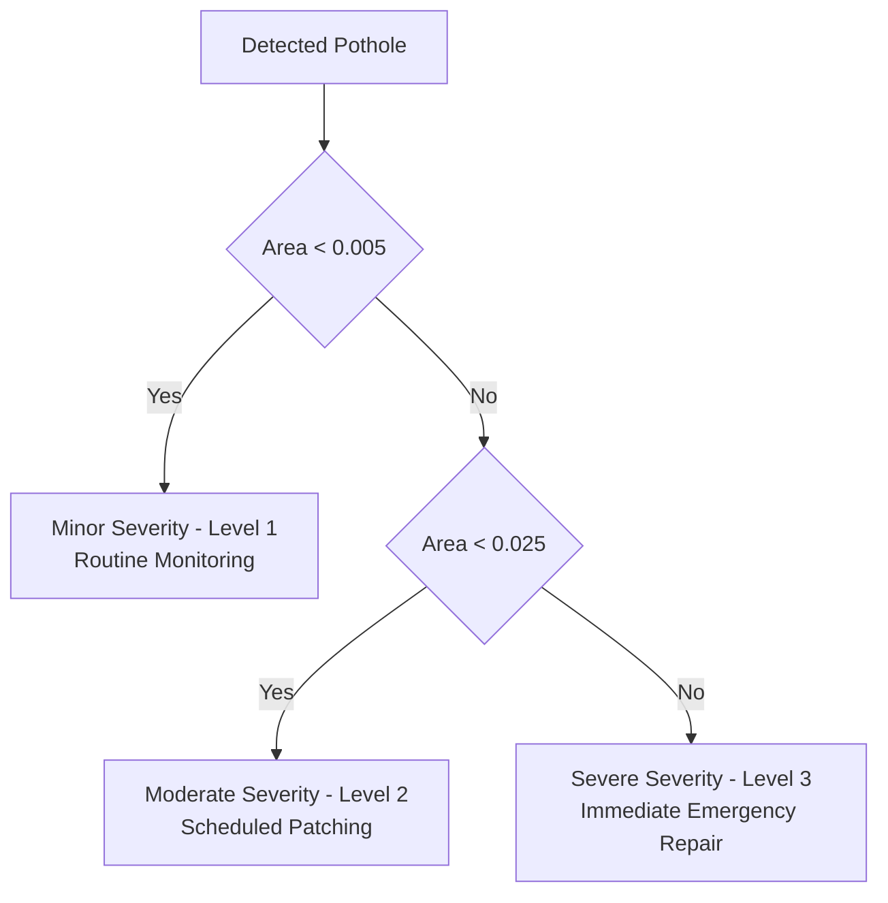

# Object Detection and Severity Classification Model Architecture

This document details the deep learning model architectures, feature fusion mechanics, decoupled head designs, and post-processing severity classification logic for the UAV-based automated road inspection system.

---

## 1. Primary Detector: YOLOv11 (SOTA Aerial Architecture)

### 1.1 Architectural Overview
YOLOv11 represents the latest evolution in real-time object detection, engineered to deliver higher mean Average Precision (mAP) while reducing computational complexity (FLOPs and parameter footprint). In aerial UAV inspection, where small target features (such as thin fractures and distant potholes) must be identified against textured road aggregate, YOLOv11 introduces critical architectural refinements.

```
       Input (640x640x3)
              │
              ▼
   ┌──────────────────────┐
   │       BACKBONE       │  Modified CSPDarknet with C3k2 Blocks
   │  Feature Extraction  │  + Spatial Pyramid Pooling Fast (SPPF)
   └──────────┬───────────┘
              │  P3, P4, P5 multi-scale feature maps
              ▼
   ┌──────────────────────┐
   │         NECK         │  Path Aggregation Network (PANet)
   │    Feature Fusion    │  Top-Down & Bottom-Up Bi-Directional Paths
   └──────────┬───────────┘
              │  Fused multi-scale representations
              ▼
   ┌──────────────────────┐
   │   DECOUPLED HEADS    │  Anchor-Free Task-Specific Heads
   │  Detect & Classify   │  Branch 1: Cls (BCE) | Branch 2: Reg (CIoU + DFL)
   └──────────────────────┘
```

---

### 1.2 Backbone: C3k2 and Multi-Scale Feature Extraction
The YOLOv11 backbone is designed to capture both fine-grained geometric road defects and wider semantic context:
1. **Stem Layer:** Rapidly reduces input spatial resolution using a $3 \times 3$ strided convolution, expanding channel depth with minimal parameter growth.
2. **C3k2 Blocks (Cross-Stage Partial with 2 Convolutions):**
   - Replaces older bottleneck designs (such as C2f in YOLOv8).
   - Dynamically adapts kernel combinations ($3 \times 3$ depthwise and pointwise convolutions) based on feature map scale.
   - Preserves high-frequency gradient flow, critical for resolving faint crack lines (`grietas`) that occupy only 2–5 pixels in width.
3. **Spatial Pyramid Pooling - Fast (SPPF):**
   - Positioned at the terminal layer of the backbone ($P_5$).
   - Sequentially applies three $5 \times 5$ max-pooling operations to aggregate multi-scale receptive field context without spatial misalignment.
   - Captures contextual cues (e.g., surrounding asphalt condition, curb boundaries) that help differentiate true potholes from dark oil stains or shadows.

---

### 1.3 Neck: Enhanced Path Aggregation Network (PANet)
Aerial inspection demands robust multi-scale localization because pothole sizes range from small 20-pixel depressions to large multi-meter road washouts.
* **Top-Down Feature Pyramid:** Propagates rich semantic information from deep backbone layers ($P_5$) down to high-resolution shallow layers ($P_3$).
* **Bottom-Up Path Aggregation:** Re-propagates precise localization and spatial edge signals from shallow layers back up to deep layers.
* **Feature Fusion:** Employs cross-scale concatenation and lightweight $1 \times 1$ point convolutions to equalize channel dimensions, minimizing feature degradation across scales.

---

### 1.4 Head: Decoupled Anchor-Free Detection Head
Traditional single-head detectors face task-interference: classification features (invariant to position) and bounding box regression features (highly sensitive to spatial boundaries) conflict when processed by shared convolutional weights.

YOLOv11 addresses this with a **Decoupled Anchor-Free Head**:
1. **Task Decoupling:**
   - **Classification Branch:** Computes class probabilities using Binary Cross-Entropy Loss ($\mathcal{L}_{\text{cls}}$).
   - **Bounding Box Regression Branch:** Predicts box offsets using Complete Intersection over Union ($\mathcal{L}_{\text{CIoU}}$) combined with Distribution Focal Loss ($\mathcal{L}_{\text{DFL}}$).
2. **Anchor-Free Mechanism:**
   - Eliminates predefined anchor box aspect ratios and cluster tuning (k-means).
   - Predicts distances from candidate grid points directly to the four box edges $(l, t, r, b)$.
   - Dramatically reduces hyperparameter sensitivity when identifying irregular, non-rectangular pothole geometries.

---

## 2. Baseline Architecture: YOLOv8 Comparison

To validate the performance advantages of the proposed YOLOv11 system, a complete baseline is established using **YOLOv8**.

| Architectural Feature | Baseline (YOLOv8) | Proposed Model (YOLOv11) | Impact on UAV Road Inspection |
| :--- | :--- | :--- | :--- |
| **Primary Building Block** | C2f (Cross-Stage Partial with 2 Convs) | C3k2 (Optimized CSP block with dual kernel paths) | Better feature retention for narrow road cracks |
| **Attention / Feature Flow** | Standard gradient concatenation | Enhanced cross-channel multi-scale feature routing | Lower gradient dissipation across 4K downsampled inputs |
| **Parameter Efficiency** | Higher parameter count per FLOP | ~10-15% fewer parameters at matched capacity | Faster on-device edge inference on drone hardware |
| **Inference Latency** | Baseline FPS (~35-45 FPS on RTX GPU) | Higher throughput (~50+ FPS) | Real-time aerial survey capabilities |
| **Localization Precision** | Anchor-free decoupled head | Refined anchor-free decoupled head with optimized DFL | Reduced bounding box jitter on irregular pothole boundaries |

---

## 3. Severity Classification Module

Identifying road defects is insufficient for infrastructure management; municipal maintenance crews require **actionable, prioritized repair schedules**. Our framework implements an automated post-detection severity classification module.

### 3.1 Mathematical Formulation
The severity rating is calculated directly from the predicted bounding box properties and camera geometry.

For each detected pothole $i$, let:
* $w_i \in [0, 1]$ be the normalized bounding box width.
* $h_i \in [0, 1]$ be the normalized bounding box height.
* $\text{conf}_i \ge \tau_{\text{conf}}$ be the detection confidence score (default threshold: $0.40$).

The normalized surface area footprint $A_i$ is defined as:

$$A_i = w_i \times h_i$$

For calibrated flight altitudes (where UAV altitude $H$ and ground sampling distance $\text{GSD}$ are known), the physical metric area $S_i$ (in $\text{m}^2$) can be estimated by:

$$S_i = (w_i \cdot W_{\text{image}} \cdot \text{GSD}) \times (h_i \cdot H_{\text{image}} \cdot \text{GSD})$$

---

### 3.2 Severity Thresholds & Decision Logic

Defects are mapped into three discrete severity levels:



1. **Minor Severity ($\text{Level 1}$): $A_i < 0.005$**
   - **Description:** Superficial depressions, localized chipping, or minor raveling.
   - **Safety Impact:** Low vehicle hazard; negligible suspension damage.
   - **Maintenance Action:** Logged into municipal GIS for routine biannual inspection.
2. **Moderate Severity ($\text{Level 2}$): $0.005 \le A_i < 0.025$**
   - **Description:** Medium-sized potholes (approx. 20 cm to 50 cm across) penetrating asphalt wearing layers.
   - **Safety Impact:** Noticeable vehicle jarring, tire damage risk at high speeds.
   - **Maintenance Action:** Scheduled for standard hot-mix asphalt patching within 14 business days.
3. **Severe Severity ($\text{Level 3}$): $A_i \ge 0.025$**
   - **Description:** Deep, extensive cratering, continuous structural road collapse, or multi-depression clusters.
   - **Safety Impact:** Critical risk of vehicle loss of control, rim fracture, and road accidents.
   - **Maintenance Action:** Flagged with high-priority emergency alerts for dispatch within 24–48 hours.

---

### 3.3 Maintenance Priority Score (MPS)
To rank road sectors objectively, a composite **Maintenance Priority Score (MPS)** is evaluated per surveyed kilometer:

$$\text{MPS} = \sum_{i=1}^{N_{\text{potholes}}} \left( \omega_1 \cdot \text{conf}_i + \omega_2 \cdot A_i + \text{SeverityWeight}_i \right)$$

where $\text{SeverityWeight} \in \{1 \text{ for Minor}, 3 \text{ for Moderate}, 7 \text{ for Severe}\}$. This metric directly feeds into municipal PWD scheduling software.
